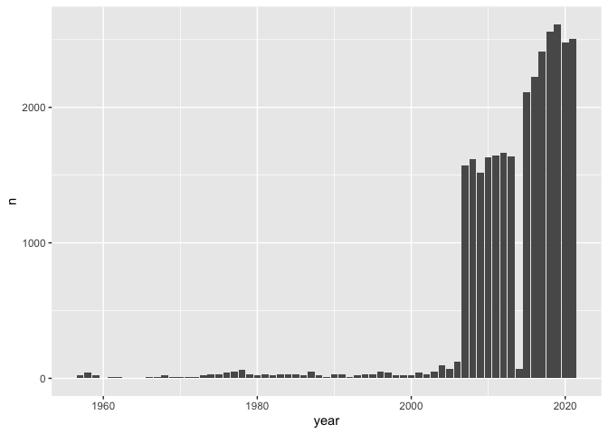
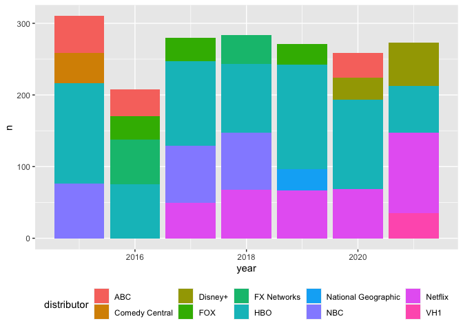
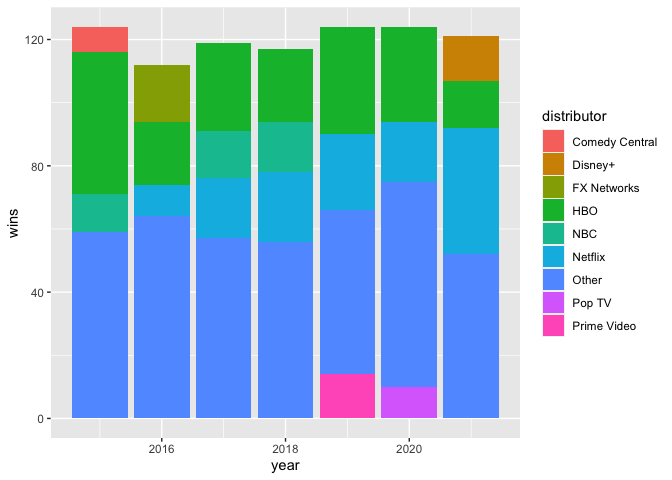
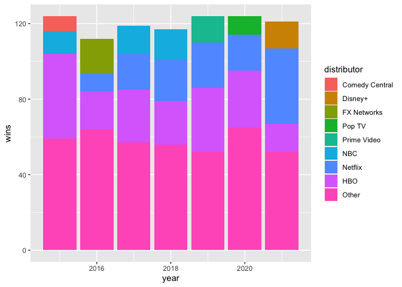

Emmys
================

``` r
library(tidytuesdayR)
library(tidyverse)
library(lubridate)
library(purrr)
library(rlang)
library(fs)
```

Download and save data into *rds* files.

``` r
if(length(dir_ls(glob = "*.rds")) == 0) {
  imap(
    tt_load("2021-09-21"), 
    ~ write_rds(.x, path(.y, ext = "rds"))
  )}
```

Checking out the data set

``` r
data_nominees <- read_rds("nominees.rds")

glimpse(data_nominees)
#> Rows: 29,678
#> Columns: 10
#> $ category    <chr> "Outstanding Character Voice-Over Performance - 2021", "Ou…
#> $ logo        <chr> "https://www.emmys.com/sites/default/files/styles/show_sea…
#> $ production  <chr> NA, NA, NA, NA, "Elisabeth Williams, Production Designer",…
#> $ type        <chr> "Nominee", "Nominee", "Nominee", "Nominee", "Nominee", "No…
#> $ title       <chr> "black-ish: Election Special (Part 2)", "Bridgerton", "Fam…
#> $ distributor <chr> "ABC", "Netflix", "FOX", "FX Networks", "Hulu", "Hulu", "H…
#> $ producer    <chr> "ABC", "A Netflix Original Series in association with shon…
#> $ year        <dbl> 2021, 2021, 2021, 2021, 2021, 2021, 2021, 2021, 2021, 2021…
#> $ page        <dbl> 0, 0, 0, 0, 0, 0, 0, 0, 0, 0, 0, 0, 0, 0, 0, 0, 0, 0, 0, 0…
#> $ page_id     <dbl> 1, 2, 3, 4, 5, 5, 5, 5, 6, 6, 6, 7, 7, 7, 8, 8, 8, 9, 9, 9…
```

Cursory plotting of the data revealed a data issue. The number of
nominees jump in 2,000’s. There another dip on 2,014.

``` r
data_nominees %>% 
  count(year) %>% 
  ggplot(aes(year, n)) +
  geom_col()
```


A quick count shows that we should use the data from 2,015 and after.

``` r
data_nominees %>% 
  count(year) %>% 
  arrange(-year) %>% 
  head(20)
#> # A tibble: 20 × 2
#>     year     n
#>    <dbl> <int>
#>  1  2021  2506
#>  2  2020  2478
#>  3  2019  2613
#>  4  2018  2562
#>  5  2017  2413
#>  6  2016  2223
#>  7  2015  2113
#>  8  2014    70
#>  9  2013  1641
#> 10  2012  1667
#> 11  2011  1643
#> 12  2010  1632
#> 13  2009  1519
#> 14  2008  1616
#> 15  2007  1570
#> 16  2006   124
#> 17  2005    68
#> 18  2004    94
#> 19  2003    50
#> 20  2002    30
```

Plotting the top 5 winning Distributors. VH1 suddenly appears as a
contender on 2,021

``` r
data_nominees %>% 
  filter(year >= 2015, type == "Winner") %>% 
  count(year, distributor) %>% 
  arrange(year, -n) %>% 
  group_by(year) %>% 
  mutate(rn = row_number()) %>% 
  filter(rn <= 4) %>% 
  ungroup() %>% 
  ggplot() +
  geom_col(aes(year, n, fill = distributor)) +
  theme(legend.position = "bottom")
```


Pulling up the data for VH1 shows that there is an entry per Producer,
thus inflating the number of “wins” that needs to be deduped.

``` r
data_nominees %>% 
  filter(year >= 2015, type == "Winner", distributor == "VH1") %>% 
  select(category, title, production, year)
#> # A tibble: 108 × 4
#>    category                             title          production           year
#>    <chr>                                <chr>          <chr>               <dbl>
#>  1 Outstanding Casting For A Reality P… RuPaul's Drag… Goloka Bolte, CSA,…  2021
#>  2 Outstanding Casting For A Reality P… RuPaul's Drag… Ethan Petersen, CS…  2021
#>  3 Outstanding Directing For A Reality… RuPaul's Drag… Nick Murray, Direc…  2021
#>  4 Outstanding Host For A Reality Or C… RuPaul's Drag… <NA>                 2021
#>  5 Outstanding Picture Editing For A S… RuPaul's Drag… Jamie Martin, Lead…  2021
#>  6 Outstanding Picture Editing For A S… RuPaul's Drag… Paul Cross, Editor   2021
#>  7 Outstanding Picture Editing For A S… RuPaul's Drag… Ryan Mallick, Edit…  2021
#>  8 Outstanding Picture Editing For A S… RuPaul's Drag… Michael Roha, Edit…  2021
#>  9 Outstanding Unstructured Reality Pr… RuPaul's Drag… Fenton Bailey, Exe…  2021
#> 10 Outstanding Unstructured Reality Pr… RuPaul's Drag… Randy Barbato, Exe…  2021
#> # … with 98 more rows
```

``` r
prep_winners <- data_nominees %>% 
  filter(year >= 2015, type == "Winner") %>% 
  mutate(
    category = str_sub(category, 1, nchar(category) - 7),
    category = str_to_title(category)
    ) %>% 
  group_by(category, title, year, distributor) %>% 
  summarise(.groups = "drop") %>% 
  ungroup() %>% 
  arrange(category, title, year, distributor)

glimpse(prep_winners)
#> Rows: 841
#> Columns: 4
#> $ category    <chr> "Exceptional Merit In Documentary Filmmaking", "Exceptiona…
#> $ title       <chr> "76 Days", "Citizenfour", "LA 92", "RBG", "Strong Island",…
#> $ year        <dbl> 2021, 2015, 2017, 2019, 2018, 2020, 2019, 2020, 2017, 2018…
#> $ distributor <chr> "Pluto TV", "HBO", "National Geographic", "CNN", "Netflix"…
```

``` r
prep_winners %>% 
  count(year)
#> # A tibble: 7 × 2
#>    year     n
#>   <dbl> <int>
#> 1  2015   124
#> 2  2016   112
#> 3  2017   119
#> 4  2018   117
#> 5  2019   124
#> 6  2020   124
#> 7  2021   121
```

``` r
dist_winners <- prep_winners %>% 
  count(year, distributor, sort = TRUE) %>% 
  ungroup() %>% 
  arrange(year, -n) %>% 
  group_by(year) %>% 
  mutate(
    top = ifelse(row_number() <= 3, TRUE, FALSE),
    distributor = ifelse(top, distributor, "Other")
    ) %>% 
  group_by(year, distributor) %>% 
  summarise(wins = sum(n), .groups = "drop")

dist_winners %>% 
  ggplot() +
  geom_col(aes(year, wins, fill = distributor))
```



``` r
prep_winners %>% 
  filter(year == 2015, distributor == "Comedy Central") %>% 
  count(title, sort = TRUE)
#> # A tibble: 5 × 2
#>   title                               n
#>   <chr>                           <int>
#> 1 The Daily Show With Jon Stewart     3
#> 2 Inside Amy Schumer                  2
#> 3 @midnight With Chris Hardwick       1
#> 4 Drunk History                       1
#> 5 The Colbert Report                  1
```

``` r
prep_winners %>% 
  filter(year == 2020, distributor == "Pop TV") %>% 
  count(title, sort = TRUE)
#> # A tibble: 2 × 2
#>   title                 n
#>   <chr>             <int>
#> 1 Schitt's Creek        9
#> 2 One Day at a Time     1
```

``` r
prep_winners %>% 
  filter(year == 2016, distributor == "FX Networks") %>% 
  count(title, sort = TRUE)
#> # A tibble: 8 × 2
#>   title                                                             n
#>   <chr>                                                         <int>
#> 1 The People v. O.J. Simpson: American Crime Story                  9
#> 2 American Horror Story: Hotel                                      2
#> 3 Fargo                                                             2
#> 4 Archer                                                            1
#> 5 Archer Scavenger Hunt                                             1
#> 6 Baskets                                                           1
#> 7 Inside Look: The People v. O.J. Simpson: American Crime Story     1
#> 8 The Americans                                                     1
```

``` r
prep_winners %>% 
  filter(year == 2019, distributor == "Prime Video") %>% 
  count(title, sort = TRUE)
#> # A tibble: 3 × 2
#>   title                         n
#>   <chr>                     <int>
#> 1 The Marvelous Mrs. Maisel     7
#> 2 Fleabag                       6
#> 3 A Very English Scandal        1
```

``` r
prep_winners %>% 
  filter( distributor == "NBC") %>% 
  count(year, title, sort = TRUE) %>% 
  pivot_wider(names_from = "year", values_from = "n")
#> # A tibble: 13 × 8
#>    title                        `2017` `2018` `2021` `2020` `2019` `2015` `2016`
#>    <chr>                         <int>  <int>  <int>  <int>  <int>  <int>  <int>
#>  1 Saturday Night Live               9      8      8      6      5      2      3
#>  2 Jesus Christ Superstar Live…     NA      5     NA     NA     NA     NA     NA
#>  3 The Saturday Night Live 40t…     NA     NA     NA     NA     NA      4     NA
#>  4 Hairspray Live!                   3     NA     NA     NA     NA     NA     NA
#>  5 Super Bowl XLIX Halftime Sh…     NA     NA     NA     NA     NA      2     NA
#>  6 The Voice                         1     NA     NA     NA     NA      2      1
#>  7 This Is Us                        2      1     NA      1     NA     NA     NA
#>  8 Will & Grace                     NA      2     NA     NA     NA     NA     NA
#>  9 Hollywood Game Night             NA     NA     NA     NA     NA      1     NA
#> 10 The Tonight Show Starring J…     NA     NA     NA     NA     NA      1     NA
#> 11 The Wiz Live!                    NA     NA     NA     NA     NA     NA      1
#> 12 World Of Dance                   NA     NA     NA     NA      1     NA     NA
#> 13 Zoey's Extraordinary Playli…     NA     NA     NA      1     NA     NA     NA
```

``` r
order_dist <- dist_winners %>% 
  count(distributor) %>% 
  arrange(n) %>% 
  pull(distributor)

order_dist
#> [1] "Comedy Central" "Disney+"        "FX Networks"    "Pop TV"        
#> [5] "Prime Video"    "NBC"            "Netflix"        "HBO"           
#> [9] "Other"
```

``` r
prep_winners %>% 
  filter(year == 2021, distributor == "Disney+") %>% 
  count(title, sort = TRUE)
#> # A tibble: 5 × 2
#>   title                     n
#>   <chr>                 <int>
#> 1 The Mandalorian           7
#> 2 WandaVision               3
#> 3 Hamilton                  2
#> 4 Black Is King             1
#> 5 Secrets Of The Whales     1
```

``` r
prep_winners %>% 
  filter(title == "The Mandalorian") %>% 
  arrange(year)
#> # A tibble: 14 × 4
#>    category                                         title       year distributor
#>    <chr>                                            <chr>      <dbl> <chr>      
#>  1 Outstanding Cinematography For A Single-Camera … The Manda…  2020 Disney+    
#>  2 Outstanding Music Composition For A Series (Ori… The Manda…  2020 Disney+    
#>  3 Outstanding Production Design For A Narrative P… The Manda…  2020 Disney+    
#>  4 Outstanding Sound Editing For A Comedy Or Drama… The Manda…  2020 Disney+    
#>  5 Outstanding Sound Mixing For A Comedy Or Drama … The Manda…  2020 Disney+    
#>  6 Outstanding Special Visual Effects               The Manda…  2020 Disney+    
#>  7 Outstanding Stunt Coordination For A Drama Seri… The Manda…  2020 Disney+    
#>  8 Outstanding Cinematography For A Single-Camera … The Manda…  2021 Disney+    
#>  9 Outstanding Music Composition For A Series (Ori… The Manda…  2021 Disney+    
#> 10 Outstanding Prosthetic Makeup                    The Manda…  2021 Disney+    
#> 11 Outstanding Sound Mixing For A Comedy Or Drama … The Manda…  2021 Disney+    
#> 12 Outstanding Special Visual Effects In A Season … The Manda…  2021 Disney+    
#> 13 Outstanding Stunt Coordination                   The Manda…  2021 Disney+    
#> 14 Outstanding Stunt Performance                    The Manda…  2021 Disney+
```

``` r
dist_winners %>% 
  #filter(distributor != "Other") %>% 
  mutate(distributor = fct_relevel(distributor, order_dist)) %>% 
  ggplot() +
  geom_col(aes(year, wins, fill = distributor), position = position_stack()) 
```


